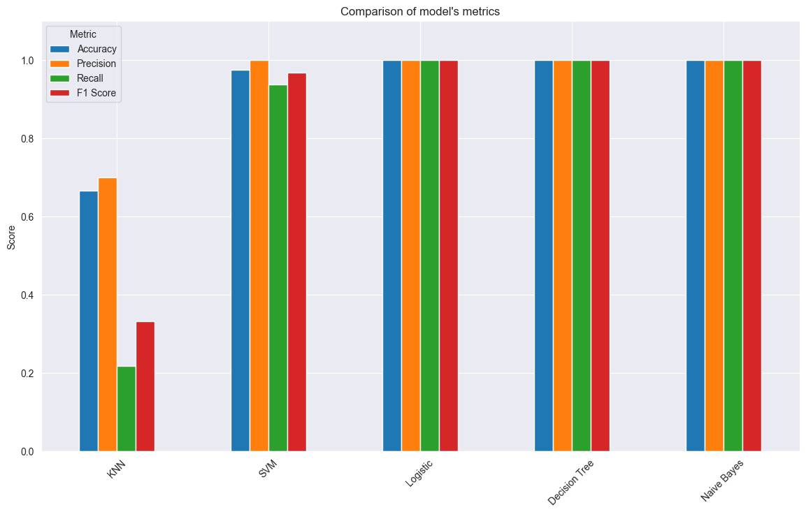

Titanic Survival Classifier 🚢

This project predicts passenger survival on the Titanic using different machine learning classifiers.
It includes data preprocessing, model training, evaluation, and comparison of results across various algorithms.

## Project Overview
- Dataset: Titanic survival dataset (tested.csv)
- Goal: Predict whether a passenger survived or not.
- Techniques: Data cleaning, feature engineering, model selection, model evaluation.
Features
  - Data preprocessing (handling missing values, encoding categorical variables)
  - Exploratory Data Analysis (feature correlation heatmap)
  - Model Training:
    - K-Nearest Neighbors (KNN)
    - Support Vector Machine (SVM)
    - Logistic Regression
    - Decision Tree
    - Naive Bayes
  - Performance metrics:
    - Accuracy
    - Precision
    - F1 Score
    - Visualization of results (heatmaps, bar charts)

**Technologies Used**
- Python
- Pandas
- NumPy
- Scikit-Learn
- Matplotlib
- Seaborn

**Results**
- Models were compared based on Accuracy, Precision, Recall, and F1 Score.
- KNN, SVM, Logistic Regression, Decision Tree, and Naive Bayes performances are visualized for easy comparison.

# How to Run
1. Clone the repository
2. Install the required libraries (`pip install -r requirements.txt`).
3. Open the notebook and run all cells.